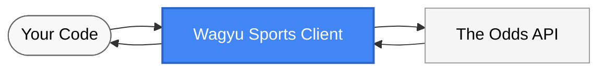

# Python Odds API Client

Python client for The Odds API v4, providing access to sports betting data.



## Directory Structure

The project has been reorganized for better maintainability:
- `wagyu_sports/build/` - Build-related files (pyproject.toml, requirements.txt, setup.py)
- `wagyu_sports/config/` - Configuration files (.env.example, pytest.ini)
- `wagyu_sports/docs/` - Documentation (LICENSE, README.md)
- `wagyu_sports/examples/` - Example scripts
- `wagyu_sports/tests/` - Test files

## Installation

```bash
pip install -e .
cp wagyu_sports/config/.env.example wagyu_sports/config/.env
# Add your API key to .env (get one from https://the-odds-api.com/)
```

## Usage

```python
from wagyu_sports import OddsClient
import os
from dotenv import load_dotenv

# Load API key
load_dotenv(dotenv_path="wagyu_sports/config/.env")
api_key = os.getenv("ODDS_API_KEY")

# Get sports data
client = OddsClient(api_key)
sports = client.get_sports()
print(f"Available sports: {len(sports['data'])}")

# Get odds for NBA
odds = client.get_odds("basketball_nba", {"regions": "us", "markets": "h2h"})
```

## Features

- Access all endpoints of The Odds API v4
- Track API usage through response headers
- Support for all API parameters and options
- Utility functions for saving responses and testing

## Examples

The `wagyu_sports/examples/` directory contains:
- `example.py`: Basic usage
- `advanced_example.py`: Error handling, quota management, data processing
- `fetch_nba_odds.py`: NBA-specific example
- `verify_install.py`: Installation verification

## Testing

```bash
cd wagyu_sports
pytest --rootdir=. -c config/pytest.ini
```

## API Documentation

For full API documentation, visit [The Odds API](https://the-odds-api.com/liveapi/guides/v4/).
