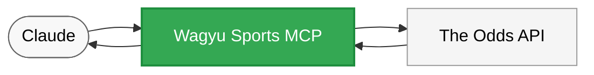

# Wagyu Sports MCP Server

<p align="center">
  
</p>

A Model Context Protocol (MCP) server for sports betting data, providing access to The Odds API through Claude and other MCP-compatible AI assistants.



## Quick Setup

1. **Clone the repository**:
   ```bash
   # Clone the repository
   git clone https://github.com/your-username/wagyu_mcp_hackathon.git
   cd wagyu_mcp_hackathon
   ```

2. **Install the package**:
   ```bash
   # Using pip (recommended)
   pip install -e .
   
   # Or using uv (alternative)
   uv install -e .
   ```

3. **Add to your MCP configuration**:

   For Cline, add to `~/Library/Application Support/Code/User/globalStorage/saoudrizwan.claude-dev/settings/cline_mcp_settings.json`:

   ```json
   {
     "mcpServers": {
       "wagyu-sports": {
         "command": "python",
         "args": ["/absolute/path/to/wagyu_mcp_hackathon/wagyu_sports/mcp_server/test_server.py", "--test-mode"],
         "env": {
           "ODDS_API_KEY": "your_api_key_here"
         },
         "disabled": false,
         "autoApprove": []
       }
     }
   }
   ```

   For Claude Desktop, add to `~/Library/Application Support/Claude/claude_desktop_config.json`:

   ```json
   {
     "mcpServers": {
       "wagyu-sports": {
         "command": "python",
         "args": ["/absolute/path/to/wagyu_mcp_hackathon/wagyu_sports/mcp_server/test_server.py", "--test-mode"],
         "env": {
           "ODDS_API_KEY": "your_api_key_here"
         },
         "disabled": false,
         "autoApprove": []
       }
     }
   }
   ```

   > **IMPORTANT**: Replace `/absolute/path/to/wagyu_mcp_hackathon` with the actual full path to your repository. For example: `/Users/john/Documents/hackathon/wagyu_mcp_hackathon`.

4. **Get an API key** from [The Odds API](https://the-odds-api.com/) and replace `your_api_key_here` in the configuration.

5. **Restart your MCP client** (Cline or Claude Desktop).

## Available Tools

The MCP server provides the following tools:

- `get_sports`: Get a list of available sports
- `get_odds`: Get odds for a specific sport
- `get_quota_info`: Get API quota information

## Test Mode vs. Real Mode

### Test Mode (Recommended for Getting Started)

Test mode uses mock data instead of making real API calls. This is useful for:
- Development and testing without API rate limits
- Demos and presentations
- Learning how to use the MCP server

To use test mode:
1. Set `--test-mode` in your MCP configuration (as shown in the Quick Setup)
2. No API key is required
3. The server will return consistent mock data for all requests

Example configuration for test mode:
```json
"args": ["/absolute/path/to/wagyu_mcp_hackathon/wagyu_sports/mcp_server/test_server.py", "--test-mode"]
```

### Real Mode

Real mode makes actual API calls to The Odds API. This is necessary for:
- Getting real-time sports betting data
- Production applications
- Accurate odds information

To use real mode:
1. Remove the `--test-mode` flag from your MCP configuration
2. Provide a valid API key from The Odds API
3. Be aware of API rate limits (typically 500 requests per month for free tier)

Example configuration for real mode:
```json
"args": ["/absolute/path/to/wagyu_mcp_hackathon/wagyu_sports/mcp_server/test_server.py"],
"env": {
  "ODDS_API_KEY": "your_actual_api_key_here"
}
```

You can also run the server directly with:
```bash
python /path/to/wagyu_mcp_hackathon/wagyu_sports/mcp_server/test_server.py --api-key=your_api_key_here
```

## Development

For development and testing:

```bash
# Clone the repository
git clone https://github.com/your-username/wagyu_mcp_hackathon.git
cd wagyu_mcp_hackathon

# Install in development mode
pip install -e .

# Run tests
python -m pytest wagyu_sports/tests

# Run the server directly (test mode)
python wagyu_sports/mcp_server/test_server.py --test-mode

# Run the server directly (real mode)
python wagyu_sports/mcp_server/test_server.py --api-key=your_api_key_here
```

> **Note**: This repository includes a post-commit Git hook that automatically cleans up Python cache files (`__pycache__`, `.pyc`, `.pyo`, `.pyd`) and `.pytest_cache` directories after each commit.

## Project Structure

- `wagyu_sports/mcp_server/` - MCP server implementation
- `wagyu_sports/tests/` - Test files
- `wagyu_sports/examples/` - Example scripts

## For More Information

See the `wagyu_sports/README.md` file for details on using the Python client directly.
