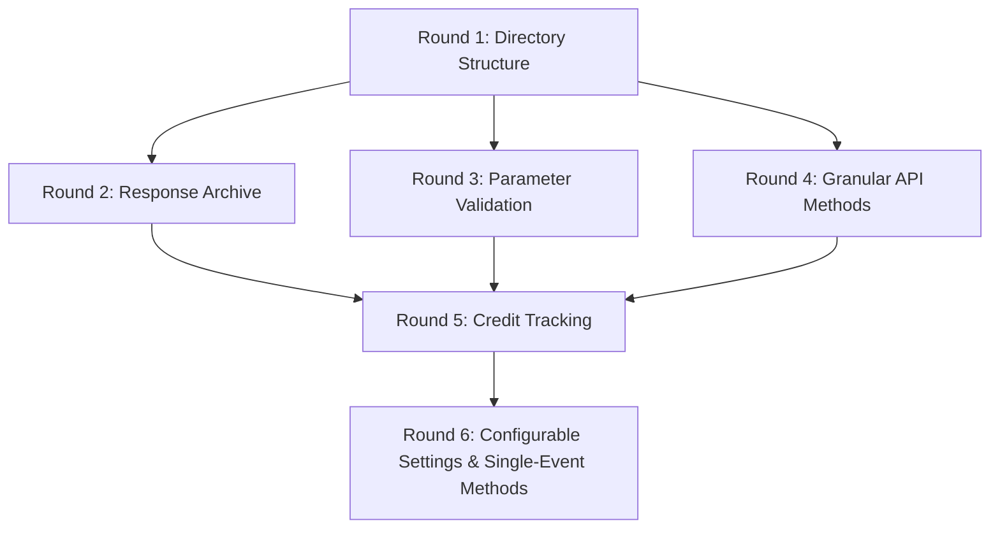

# Implementation Timeline

## Overview

This document outlines the implementation timeline for the Wagyu Sports enhancement project. The implementation is planned in 6 rounds, with each round focusing on specific aspects of the enhancement.

## Round 1: Directory Structure & Packaging

**Estimated time: 1-2 hours**

1. Create new directories:
   - `wagyu_sports/responses/`
   - `wagyu_sports/validators/`
   - `wagyu_sports/endpoints/`

2. Set up package structure:
   - Create `__init__.py` files
   - Update imports

3. Install dependencies:
   - No external dependencies required for core functionality

4. Create basic scaffolding for new modules

## Round 2: Response Archive System

**Estimated time: 2-3 hours**

1. Implement `ResponseArchive` class:
   - File-based storage system
   - Directory organization
   - Hashing and file naming

2. Integrate with `OddsClient`:
   - Add archive support to `make_request`
   - Add configuration options

3. Add mock mode support:
   - Implement `enable_mock_mode` and `disable_mock_mode`
   - Add mock mode logic to `make_request`

4. Test archive functionality:
   - Verify responses are saved correctly
   - Verify responses can be retrieved
   - Test mock mode

## Round 3: Parameter Validation

**Estimated time: 1-2 hours**

1. Implement `ParameterValidator` class:
   - Validation methods for different parameter types
   - Error message generation

2. Integrate with `OddsClient`:
   - Add validation to `make_request`
   - Add validation to endpoint-specific methods

3. Test validation functionality:
   - Verify invalid parameters are caught
   - Verify error messages are clear and helpful

## Round 4: Granular API Methods

**Estimated time: 2-3 hours**

1. Implement `EndpointHandlers` class:
   - Methods for specific API endpoints
   - Credit cost documentation

2. Integrate with `OddsClient`:
   - Add endpoint handlers to initialization
   - Add convenience methods

3. Test endpoint handlers:
   - Verify correct API calls are made
   - Verify credit costs are as expected

## Round 5: Credit Tracking & Utilities

**Estimated time: 1-2 hours**

1. Enhance `utils.py`:
   - Add credit estimation functions
   - Add credit information formatting

2. Integrate with `OddsClient`:
   - Add credit tracking to `make_request`
   - Add credit-related methods

3. Test credit tracking:
   - Verify credit estimation is accurate
   - Verify credit information is correctly formatted

## Round 6: Configurable Settings & Single-Event Methods

**Estimated time: 2-3 hours**

1. Enhance `OddsClient` initialization:
   - Add configurable defaults
   - Add configuration methods

2. Implement single-event methods:
   - Add methods to `EndpointHandlers`
   - Add convenience methods to `OddsClient`

3. Final testing and documentation:
   - Comprehensive testing of all features
   - Update documentation
   - Create examples

## Total Estimated Time

**9-15 hours**

This timeline assumes a single developer working on the project. The actual time may vary depending on the developer's familiarity with the codebase and any unforeseen challenges.

## Dependencies Between Rounds

## Milestones

1. **Basic Structure (Round 1)**: Directory structure and package setup
2. **Core Functionality (Rounds 2-4)**: Response archive, parameter validation, and granular API methods
3. **Enhanced Features (Rounds 5-6)**: Credit tracking, configurable settings, and single-event methods
4. **Final Release**: Comprehensive testing and documentation

## Rollout Strategy

1. **Development**: Implement all enhancements in a feature branch
2. **Testing**: Comprehensive testing with real API calls and mock mode
3. **Documentation**: Update documentation and examples
4. **Release**: Merge to main branch and create a new release
5. **Announcement**: Announce new features to users
