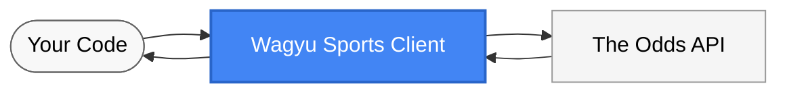

# Wagyu Sports

A Python client for sports betting data.



## Directory Structure

The project has been reorganized for better maintainability:
- `build/` - Build-related files (pyproject.toml, requirements.txt, setup.py)
- `config/` - Configuration files (.env.example, pytest.ini)
- `docs/` - Documentation (LICENSE, README.md)
- `examples/` - Example scripts
- `tests/` - Test files

## Installation

```bash
# Install the package
pip install -e . -f build/

# Set up API key
cp config/.env.example config/.env
# Edit .env and add your API key from https://the-odds-api.com/
```

## Quick Start

```python
from wagyu_sports import OddsClient
import os
from dotenv import load_dotenv

# Load API key
load_dotenv(dotenv_path="config/.env")
api_key = os.getenv("ODDS_API_KEY")

# Create client and get sports
client = OddsClient(api_key)
sports = client.get_sports()
print(f"Available sports: {len(sports['data'])}")
```

## Features

- Access to sports betting data endpoints
- Track API usage through response headers
- Support for all API parameters and options

## Examples

See the `examples/` directory for usage patterns:
- `examples/example.py`: Basic usage
- `examples/advanced_example.py`: Advanced features
- `examples/verify_install.py`: Verify installation
- `examples/fetch_nba_odds.py`: Fetch NBA odds example
- `examples/verify_import.py`: Simple import verification

## Testing

The testing suite has been cleaned up and improved for better organization and reliability. Run the tests using pytest:

```bash
# Install pytest if not already installed
pip install pytest

# Run tests
pytest --rootdir=. -c config/pytest.ini
```

Or use the Makefile:

```bash
make test
```

The test suite includes:
- Import and dependency verification
- Client initialization tests
- API method tests with proper mocking
- Error handling tests
- Environment variable loading tests
